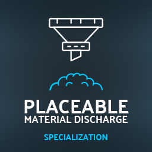

# Placeable Material Discharge

Specialization for discharging materials with placeables. This specialization enables discharging materials from ProductionPoint storage (requires ProductionPoint specialization), as well as discharging material by spawning it.

```
author: scfmod
url:    https://github.com/scfmod/FS22_PlaceableMaterialDischarge

If you distribute this mod, always include this info.

AND DO NOT UPLOAD IT TO MONATERY UPLOAD SERVICES.
THIS CODE IS AVAILABLE TO ANYONE FOR FREE AND YOU CAN USE
IT TO LEARN, FORK AND SPREAD THE KNOWLEDGE.
```

## Features

Add this specialization to you placeable in order to unlock following features:

- Discharge materials to ground and/or vehicles
- Discharge materials from Production Point storage
- Spawning and discharging materials
- Discharging from multiple sources simultaneously
- Multiple configurations which can be setup in XML and accessed by in-game GUI control panel
- Control discharging to ground and vehicles manually
- Disable/enable each discharge manually

## How to download and install

Download the latest [```FS22_1_PlaceableMaterialDischarge.zip```](https://github.com/scfmod/FS22_PlaceableMaterialDischarge/releases/latest/download/FS22_1_PlaceableMaterialDischarge.zip) and copy/move it into your FS22 mods folder.

## Multiplayer

Multiplayer is fully supported. Only farm managers and admin players will be able to access the GUI control panel in-game.

## Documentation

For implementation details and examples: [docs/INDEX.md](./docs/INDEX.md)